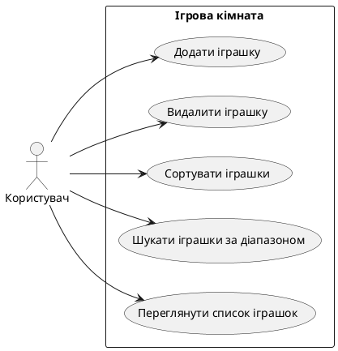

 # Ігрова кімната для дітей

## Опис проекту
Цей проект моделює ігрову кімнату для дітей різних вікових груп. Кімната містить обмежену кількість іграшок у межах бюджету. Іграшки організовані по споріднених групах (наприклад, маленькі, середні та великі машинки, ляльки, м’ячі, кубики). 

Програма дозволяє:
- Додавати та видаляти іграшки.
- Сортувати іграшки за параметрами (ціна, розмір, тип).
- Шукати іграшки за заданим діапазоном значень.
- Відображати повний список іграшок у кімнаті.

Програма реалізована з використанням принципів ООП: **наслідування, інкапсуляція, поліморфізм**.

---

## Use Case діаграма



## Use Case діаграма
```
@startuml
abstract class Toy {
    -name: String
    -size: String
    -price: Float
    -color: String
    -material: String
    +getInfo(): String
}

class Car {
    -wheels: int
    +getInfo(): String
}
class Doll {
    -hairColor: String
    +getInfo(): String
}
class Ball {
    -diameter: Float
    +getInfo(): String
}
class Block {
    -shape: String
    +getInfo(): String
}

Toy <|-- Car
Toy <|-- Doll
Toy <|-- Ball
Toy <|-- Block

class Playroom {
    -budget: Float
    -toys: List<Toy>
    +addToy(toy: Toy): Boolean
    +removeToy(toy: Toy): Boolean
    +sortToysBy(attribute: String)
    +findToysByRange(attribute: String, minValue: Float, maxValue: Float): List<Toy>
    +displayToys(): void
}

Playroom "1" -- "0..*" Toy
@enduml

```
